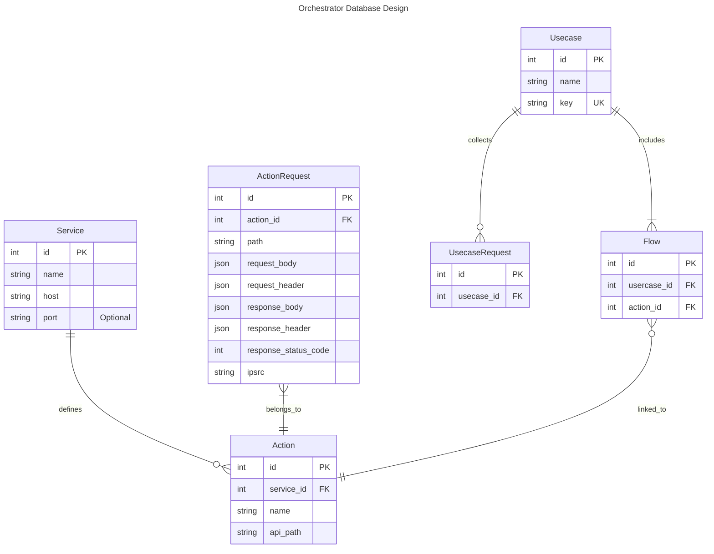

```mermaid
---
title: Orchestrator Database Design
---
erDiagram
    Service {
        int id PK
        string name
        string host
        string port "Optional"
    }

    Flow {
        int id PK
        int usercase_id FK
        int action_id FK
    }

    Action {
        int id PK
        int service_id FK
        string name
        string api_path
    }

    Usecase {
        int id PK
        string name
        string key UK
    }

    UsecaseRequest {
        int id PK
        int usecase_id FK
    }

    ActionRequest {
        int id PK
        int action_id FK
        string path
        json request_body
        json request_header
        json response_body
        json response_header
        int response_status_code
        string ipsrc
    }

    Service ||--o{ Action :defines
    Usecase ||--|{ Flow :includes

    ActionRequest |{--|| Action :belongs_to

    Flow }o--|| Action :linked_to

    Usecase ||--o{ UsecaseRequest :collects

```
